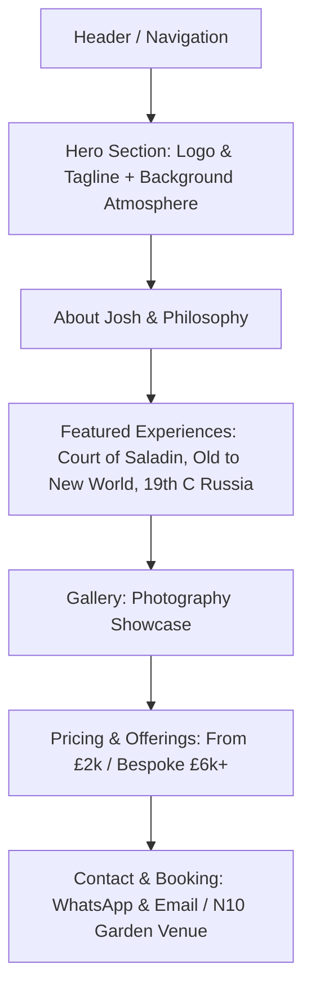

# Epochurian Website Architecture & Design Plan

## 1. Overview & Vision
Epochurian offers bespoke historical dining experiences in clients' homes. The website must evoke a classy, timeless, restrained old-world elegance (avoiding overly modern UI trends), drawing inspiration from marble, sandstone, and historical architecture.

## 2. Typography & Branding
- **Logo ("Epochurian")**: Quinsi font.
- **Tagline ("Taste History")**: Aotten font.
- **Body & Headings**: Serif/classic typography (e.g., Garamond, Playfair Display, or matching custom web fonts) to maintain an aristocratic, scholarly yet indulgent atmosphere.

## 3. Color Palette & Aesthetics
- **Primary Tones**: Warm sandstone, deep charcoal, muted gold/brass accents, and soft marble off-whites.
- **Texture/Imagery**: Highlighting Matthew Johnson's photography (`1.Party ©Matthew Johnson Photographer.jpg`, etc.) showcasing atmospheric banquets, candlelight, and historical dishes.

## 4. Website Structure (Single-Page Scroll with Navigation)

## 5. Implementation Roadmap
1. Set up project structure (`index.html`, CSS, assets).
2. Configure fonts and styling reflecting marble, sandstone, and classic restraint.
3. Build responsive sections (Hero, About, Experiences, Gallery grid, Pricing, Contact).
4. Integrate photographer assets and copy provided by Josh.
